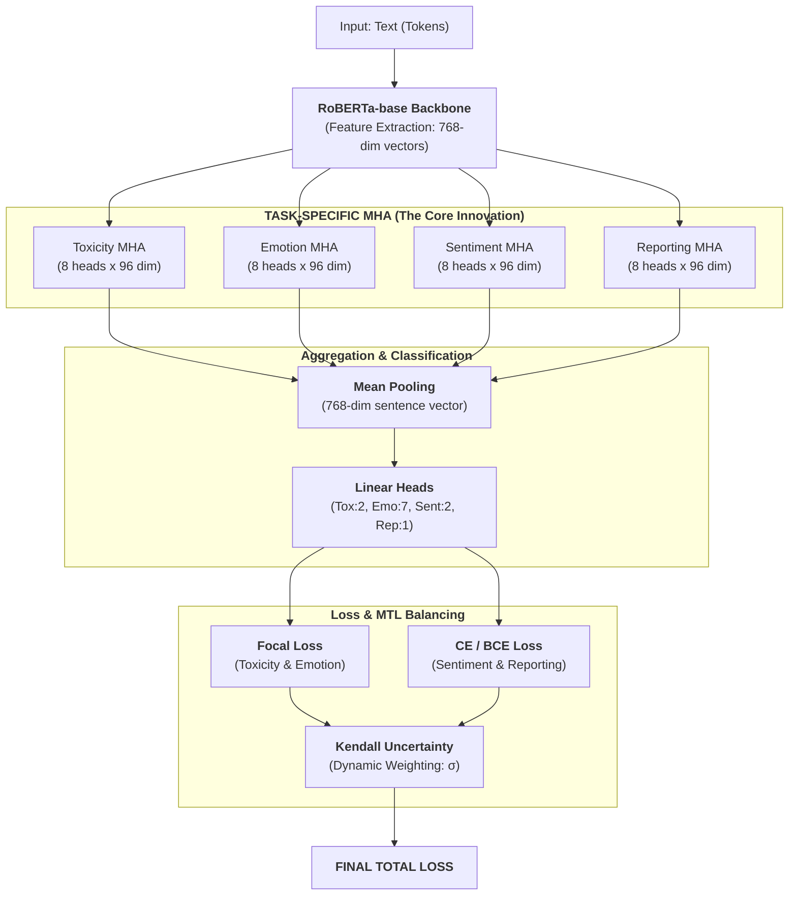

# AURA V10: COMPLETE ARCHITECTURAL STRUCTURE

This document provides a definitive, top-down view of the AURA V10 system. It maps the flow of data from the input query to the final multi-task loss calculation.

---

## 🏗️ The Multi-Task Pipeline

The following diagram illustrates the flow of information through the model:

---

## 1. The Backbone (RoBERTa-base)
- **Role**: Acts as the general-purpose "knowledge base."
- **Output**: A sequence of 768-dimensional vectors (one per token).
- **Why**: It provides a high-quality semantic understanding of the language before task-specific specialization.

## 2. Task-Specific Multi-Head Attention (TS-MHA)
- **Role**: Disentangles features for each of the 4 tasks.
- **Internal Structure**: 8 parallel heads per task.
- **The Magic**: Each head projects the 768 dimensions into a 96-dimensional **latent space** to find specific patterns (e.g., lexical insults for Toxicity, verbs for Reporting).

## 3. Mean Pooling
- **Role**: Summarizes the token-level information into a single vector for the entire sentence.
- **Critical Logic**: Uses the `attention_mask` to ensure that **Padding tokens** do not affect the average.

## 4. Classification Heads
- **Role**: Translates the abstract 768-dimensional sentence vector into actual task predictions.
- **Layers**: Linear layers followed by specific activation functions (Softmax for Toxicity/Sentiment, Sigmoid for Emotion/Reporting).

## 5. Loss Systems
- **Focal Loss**: Specifically targets "difficult" and "rare" examples in imbalanced tasks like Toxicity.
- **Kendall Uncertainty ($\sigma$)**: Automatically learns the importance of each task's loss. It acts as a "volume knob," turning down noisy tasks and turning up precise ones.
- **Phantom Gradient Fix**: A safeguard in V10.2 that zeros out the entire loss contribution of a task if it's missing from the current training batch.

---

### Summary Checklist for Exam Defense:
- [x] **Backbone**: RoBERTa (768 dim).
- [x] **Attention**: 4 Parallel TS-MHA (8 heads each, 96 dim per head).
- [x] **Aggregation**: Masked Mean Pooling.
- [x] **Multi-Task Management**: Kendall Uncertainty Weighting.
- [x] **Handling Imbalance**: Focal Loss ($\gamma = 2.0$).
